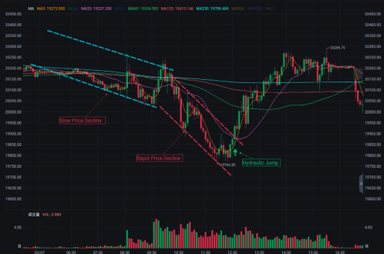

# Trading Event Detection and Model Prediction System

This comprehensive trading system helps you analyze financial data, predict trading opportunities, and test various strategies including machine learning models and traditional technical approaches.

## 🌟 System Features

- **Multiple Strategies**: Support for ML models and traditional strategies like Moving Average (MA)
- **Alpha Factor Generation**: Over 200 behavioral finance and technical alpha factors
- **Signal Generation**: Smart detection of trading events based on price patterns
- **Advanced Backtesting**: Test different strategies with detailed performance analytics
- **Real-time Simulation**: Simulate trading in real-time environments
- **Visualization Tools**: Generate intuitive charts and comprehensive performance reports

## 🌊 The Hydraulic Jump Concept

This project was inspired by the hydraulic jump phenomenon in fluid dynamics, which has striking parallels to market behavior.

A hydraulic jump occurs when a fast-flowing fluid (supercritical flow) suddenly slows down and rises in height, converting to subcritical flow. This phenomenon is observable in rivers, spillways, and open channels.


*Figure 1: Illustration of a hydraulic jump in an open channel.*

In financial markets, similar behavior can be observed:
1. **Slow Price Decline**: Analogous to the gradual flow before the critical point
2. **Rapid Price Decline**: Corresponds to the high-velocity flow
3. **Hydraulic Jump**: The point where the market suddenly reverses direction after a rapid decline


*Figure 2: Example of a market "hydraulic jump" where a rapid price decline is followed by a sudden reversal.*

This natural phenomenon provides the theoretical foundation for our trading strategy, especially for identifying potential reversal points after rapid market declines.

## 📊 Main Components

### 1. Trading Strategies
- **Machine Learning Models**: Train prediction models using historical data
- **Moving Average Strategy**: Classic MA crossover strategy with optimization
- **Signal Generator**: Generate trading signals based on price patterns
- **Alpha Factors**: Comprehensive collection of alpha factors based on behavioral finance

### 2. Data Processing
- **Feature Engineering**: Advanced feature creation and selection
- **Technical Indicators**: Calculation of numerous technical indicators
- **Futures Filtering**: Filter futures data by date and time session

### 3. Performance Analysis
- **Backtesting Engine**: Evaluate strategies with detailed metrics
- **Visualization Tools**: Generate various charts and performance reports
- **Optimization Tools**: Find optimal parameters for different strategies

## 💻 Installation Guide

Ensure you have Python 3.8 or higher installed, then run:

```bash
pip install -r requirements.txt
```

Note: TA-Lib may require additional installation steps, please refer to its official documentation.

## 🚀 Quick Start Guide

### Basic Usage

```bash
python main.py --mode all --data data/raw/your_data.xlsx
```

### Using MA Strategy

```bash
python main.py --mode ma_strategy --validation-data data/raw/validation_data.xlsx --ma-period 5
```

MA Strategy parameters:
- `--ma-period`: Moving average period (default: 5)
- `--commission`: Trading commission (default: 0.0)
- `--price-col`: Price column name (default: 'Close')
- `--min-hold-periods`: Minimum holding periods (default: 5)
- `--optimize`: Run parameter optimization

### Training a Model

```bash
python main.py --mode train --data data/raw/training_data.xlsx --model lightgbm --trials 100
```

Available model options: `randomforest`, `gradientboosting`, `xgboost`, `lightgbm`, `catboost`

### Backtesting a Model

```bash
python main.py --mode backtest --validation-data data/raw/validation_data.xlsx --model-path models/your_model.joblib --feature-path models/your_features.xlsx --scaler-path models/your_scaler.joblib
```

### Simulating Real-time Trading

```bash
python main.py --mode simulate --validation-data data/raw/validation_data.xlsx --model-path models/your_model.joblib --feature-path models/your_features.xlsx --scaler-path models/your_scaler.joblib --long-threshold 0.0026 --short-threshold 0.0026
```

## 📁 Project Structure

```
trading_event_prediction/
│
├── src/                          # Source code directory
│   ├── __init__.py              # Makes src an importable package
│   ├── event_detection.py       # Event detection module
│   ├── feature_engineering.py   # Feature engineering module
│   ├── model.py                 # Model training and evaluation
│   ├── backtesting.py           # Backtesting module
│   ├── visualization.py         # Visualization tools
│   ├── ma_strategy.py           # MA strategy implementation
│   └── utils.py                 # Helper functions
│
├── package/                      # External functionality packages
│   ├── __init__.py              # Makes package importable
│   ├── alpha_eric.py            # Alpha factor calculations
│   ├── FE.py                    # Feature engineering tools
│   ├── ModelLoader.py           # Model loading utilities
│   ├── FuturesFilter.py         # Futures data filtering
│
├── examples/                     # Example scripts
│   ├── basic_example.py         # Basic usage example
│   ├── model_training.py        # Model training example
│   └── backtesting_example.py   # Backtesting example
│
├── data/                         # Data directory
│   ├── raw/                     # Raw data
│   └── processed/               # Processed data
│
├── Figure/                       # Image directory
│   ├── HJ.png                   # Hydraulic jump diagram
│   └── example.png              # Market hydraulic jump example
│
├── models/                       # Saved trained models
│
├── results/                      # Results output directory
│   ├── visualizations/          # Chart outputs
│   ├── backtests/               # Backtest results
│   └── summaries/               # Analysis summaries
│
├── main.py                       # Main program entry point
└── requirements.txt              # Project dependencies
```

## 📋 Example Scripts

The system includes several example scripts to help you get started:

1. **Basic Example** (`basic_example.py`): 
   - Demonstrates basic usage of the system components
   - Shows how to load data and apply simple analysis

2. **Model Training** (`model_training.py`):
   - Complete example of training a machine learning model
   - Includes feature selection, hyperparameter tuning, and evaluation

3. **Backtesting Example** (`backtesting_example.py`):
   - Shows how to backtest different strategies
   - Demonstrates result analysis and visualization

## 📈 Strategy Details

### MA Strategy Features

The Moving Average (MA) strategy module implements trading based on price crossovers with a moving average line:

- **Signal Generation**: Buy when price crosses above MA, sell when price crosses below MA
- **Time Filters**: Automatically handles market sessions (morning/afternoon trading hours)
- **Parameter Optimization**: Can test multiple MA periods to find optimal settings
- **Performance Analytics**: Generates detailed performance metrics and visualizations

### Signal Generator

The SignalGenerator class creates trading signals based on market behaviors:

- **Return Threshold**: Configure minimum return thresholds for signal generation
- **Volatility Analysis**: Adjust for market volatility in signal calculations
- **Position Management**: Handle signal filtering and position size recommendations

### Alpha Factors

The system includes over 200 alpha factors based on behavioral finance theories:

- **Prospect Theory**: Factors based on risk aversion and reference-dependent preferences
- **Herding Behavior**: Factors capturing market herding and sentiment shifts
- **Anchoring Effect**: Factors analyzing anchoring biases in trading behavior
- **Market Microstructure**: Factors based on trading volume, volatility, and price momentum

## 🧠 Machine Learning Models

The system supports multiple machine learning algorithms for trading prediction:

- **RandomForest**: Ensemble learning method using multiple decision trees
- **GradientBoosting**: Sequential ensemble technique that combines weak learners
- **XGBoost**: Optimized gradient boosting implementation
- **LightGBM**: High-performance gradient boosting framework by Microsoft
- **CatBoost**: Gradient boosting algorithm with categorical feature support

Model hyperparameters are optimized using Bayesian optimization to find the best settings for your specific data.

## 📊 Performance Metrics

The system calculates comprehensive performance metrics for strategy evaluation:

- **Total P&L**: Overall profit and loss
- **Win Rate**: Percentage of profitable trades
- **Profit Factor**: Ratio of gross profits to gross losses
- **Sharpe Ratio**: Risk-adjusted return metric
- **Max Drawdown**: Largest drop from peak to trough
- **P&L to Max Drawdown Ratio**: Relationship between profit and risk
- **Separate Long/Short Analysis**: Performance metrics broken down by trade direction

## ⚠️ Notes

- This project is for learning and research purposes only and does not constitute investment advice.
- Please carefully evaluate backtest results and consider model limitations.
- Thoroughly test and evaluate strategies before using actual funds for trading.
